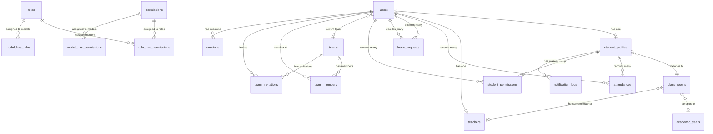
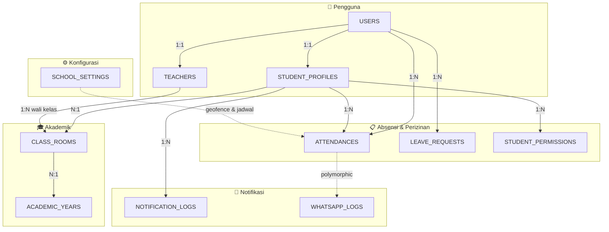

# 📊 Entity Relationship Diagram — Absenku Database

> Diagram ini dibuat berdasarkan analisis **41 file migration** Laravel pada proyek Absenku.

---

## 🖼️ Gambar ERD

---

## 📦 Daftar Entitas & Atribut Lengkap

### 1. USERS (Pengguna)
| Atribut | Tipe Data | Keterangan |
|---|---|---|
| **id** | BIGINT | 🔑 Primary Key |
| name | VARCHAR | Nama pengguna |
| email | VARCHAR | ✉️ Unique, email login |
| email_verified_at | TIMESTAMP | Waktu verifikasi email |
| password | VARCHAR | Password (hashed) |
| whatsapp_number | VARCHAR | Nomor WhatsApp |
| whatsapp_otp | VARCHAR(6) | Kode OTP WhatsApp |
| whatsapp_otp_expires_at | TIMESTAMP | Waktu kadaluarsa OTP |
| two_factor_secret | TEXT | Secret 2FA |
| two_factor_recovery_codes | TEXT | Recovery codes 2FA |
| two_factor_confirmed_at | TIMESTAMP | Konfirmasi 2FA |
| current_team_id | BIGINT | 🔗 FK → teams.id |
| role | VARCHAR | Role pengguna |
| must_change_password | BOOLEAN | Wajib ganti password (default: true) |
| remember_token | VARCHAR | Token "remember me" |
| created_at | TIMESTAMP | Waktu dibuat |
| updated_at | TIMESTAMP | Waktu diperbarui |

---

### 2. STUDENT_PROFILES (Profil Siswa)
| Atribut | Tipe Data | Keterangan |
|---|---|---|
| **id** | BIGINT | 🔑 Primary Key |
| user_id | BIGINT | 🔗 FK → users.id (Unique, CASCADE DELETE) |
| class_room_id | BIGINT | 🔗 FK → class_rooms.id |
| jurusan | VARCHAR | Jurusan siswa |
| nis | VARCHAR | ✳️ Unique, Nomor Induk Siswa |
| parent_name | VARCHAR | Nama orang tua |
| parent_phone_wa | VARCHAR | No. WA orang tua (baru) |
| parent_whatsapp_number | VARCHAR | No. WA orang tua (lama) |
| photo | VARCHAR | Path foto siswa |
| created_at | TIMESTAMP | Waktu dibuat |
| updated_at | TIMESTAMP | Waktu diperbarui |

---

### 3. TEACHERS (Guru)
| Atribut | Tipe Data | Keterangan |
|---|---|---|
| **id** | BIGINT | 🔑 Primary Key |
| user_id | BIGINT | 🔗 FK → users.id (Unique, CASCADE DELETE) |
| nip | VARCHAR | ✳️ Unique, Nomor Induk Pegawai |
| subject | VARCHAR | Mata pelajaran |
| wali_kelas | VARCHAR | Informasi wali kelas |
| created_at | TIMESTAMP | Waktu dibuat |
| updated_at | TIMESTAMP | Waktu diperbarui |

---

### 4. CLASS_ROOMS (Kelas)
| Atribut | Tipe Data | Keterangan |
|---|---|---|
| **id** | BIGINT | 🔑 Primary Key |
| name | VARCHAR | Nama kelas |
| jurusan | VARCHAR(100) | Jurusan kelas |
| grade | VARCHAR | Tingkat kelas |
| academic_year_id | BIGINT | 🔗 FK → academic_years.id (SET NULL) |
| homeroom_teacher_id | BIGINT | 🔗 FK → teachers.id (SET NULL) |
| created_at | TIMESTAMP | Waktu dibuat |
| updated_at | TIMESTAMP | Waktu diperbarui |

> ✳️ Unique constraint: `(name, jurusan)`

---

### 5. ACADEMIC_YEARS (Tahun Ajaran)
| Atribut | Tipe Data | Keterangan |
|---|---|---|
| **id** | BIGINT | 🔑 Primary Key |
| name | VARCHAR | Nama tahun ajaran |
| start_date | DATE | Tanggal mulai |
| end_date | DATE | Tanggal selesai |
| is_active | BOOLEAN | Status aktif (default: false) |
| created_at | TIMESTAMP | Waktu dibuat |
| updated_at | TIMESTAMP | Waktu diperbarui |

---

### 6. ATTENDANCES (Absensi)
| Atribut | Tipe Data | Keterangan |
|---|---|---|
| **id** | BIGINT | 🔑 Primary Key |
| user_id | BIGINT | 🔗 FK → users.id (CASCADE DELETE) |
| student_profile_id | BIGINT | 🔗 FK → student_profiles.id (SET NULL) |
| date | DATE | Tanggal absensi |
| status | VARCHAR | Status: present / late / absent / leave |
| late_minutes | SMALLINT | Menit keterlambatan (signed) |
| notes | TEXT | Catatan |
| check_in_at | DATETIME | Waktu check-in |
| check_in_latitude | DECIMAL(10,7) | Latitude check-in |
| check_in_longitude | DECIMAL(10,7) | Longitude check-in |
| check_in_distance_meters | UINT | Jarak check-in (meter) |
| check_in_accuracy | FLOAT | Akurasi GPS check-in |
| check_out_at | DATETIME | Waktu check-out |
| check_out_late_minutes | SMALLINT (UNSIGNED) | Menit keterlambatan check-out |
| check_out_latitude | DECIMAL(10,7) | Latitude check-out |
| check_out_longitude | DECIMAL(10,7) | Longitude check-out |
| check_out_distance_meters | UINT | Jarak check-out (meter) |
| check_out_accuracy | FLOAT | Akurasi GPS check-out |
| created_at | TIMESTAMP | Waktu dibuat |
| updated_at | TIMESTAMP | Waktu diperbarui |

> ✳️ Unique constraint: `(user_id, date)` dan `(student_profile_id, date)`

---

### 7. LEAVE_REQUESTS (Permohonan Izin)
| Atribut | Tipe Data | Keterangan |
|---|---|---|
| **id** | BIGINT | 🔑 Primary Key |
| user_id | BIGINT | 🔗 FK → users.id (CASCADE DELETE) |
| date | DATE | Tanggal izin |
| type | VARCHAR | Tipe: absent / early_leave |
| reason | TEXT | Alasan izin |
| keterangan | TEXT | Keterangan tambahan |
| status | VARCHAR | Status: pending / approved / rejected |
| decided_by | BIGINT | 🔗 FK → users.id (SET NULL) |
| decided_at | DATETIME | Waktu keputusan |
| decision_note | TEXT | Catatan keputusan |
| created_at | TIMESTAMP | Waktu dibuat |
| updated_at | TIMESTAMP | Waktu diperbarui |

---

### 8. STUDENT_PERMISSIONS (Izin Siswa)
| Atribut | Tipe Data | Keterangan |
|---|---|---|
| **id** | BIGINT | 🔑 Primary Key |
| student_profile_id | BIGINT | 🔗 FK → student_profiles.id (CASCADE DELETE) |
| type | ENUM | Tipe: not_attend / early_leave |
| date | DATE | Tanggal izin |
| reason | TEXT | Alasan |
| status | ENUM | Status: pending / approved / rejected |
| reviewed_by | BIGINT | 🔗 FK → users.id (SET NULL) |
| reviewed_at | DATETIME | Waktu review |
| attachment | VARCHAR | File lampiran |
| created_at | TIMESTAMP | Waktu dibuat |
| updated_at | TIMESTAMP | Waktu diperbarui |

---

### 9. NOTIFICATION_LOGS (Log Notifikasi)
| Atribut | Tipe Data | Keterangan |
|---|---|---|
| **id** | BIGINT | 🔑 Primary Key |
| student_profile_id | BIGINT | 🔗 FK → student_profiles.id (CASCADE DELETE) |
| type | VARCHAR | Tipe notifikasi |
| message | TEXT | Isi pesan |
| wa_number | VARCHAR | Nomor WA tujuan |
| status | ENUM | Status: sent / failed |
| response_payload | JSON | Payload respons API |
| created_at | TIMESTAMP | Waktu dibuat |
| updated_at | TIMESTAMP | Waktu diperbarui |

---

### 10. WHATSAPP_LOGS (Log WhatsApp)
| Atribut | Tipe Data | Keterangan |
|---|---|---|
| **id** | BIGINT | 🔑 Primary Key |
| provider | VARCHAR | Provider WA API |
| to | VARCHAR | Nomor tujuan |
| message | TEXT | Isi pesan |
| status | VARCHAR | Status: queued / sent / failed |
| error | TEXT | Pesan error |
| related_type | VARCHAR | Polymorphic: tipe model |
| related_id | BIGINT | Polymorphic: ID model |
| sent_at | TIMESTAMP | Waktu terkirim |
| created_at | TIMESTAMP | Waktu dibuat |
| updated_at | TIMESTAMP | Waktu diperbarui |

---

### 11. SCHOOL_SETTINGS (Pengaturan Sekolah)
| Atribut | Tipe Data | Keterangan |
|---|---|---|
| **id** | BIGINT | 🔑 Primary Key |
| name | VARCHAR | Nama sekolah |
| latitude | DECIMAL(10,7) | Latitude lokasi sekolah |
| longitude | DECIMAL(10,7) | Longitude lokasi sekolah |
| radius_meters | UINT | Radius geofence (meter) |
| check_in_start_time | TIME | Waktu mulai check-in (default: 07:00) |
| check_in_end_time | TIME | Waktu akhir check-in (default: 08:00) |
| late_tolerance_minutes | SMALLINT (UNSIGNED) | Toleransi terlambat (default: 15 menit) |
| is_attendance_active | BOOLEAN | Status absensi aktif (default: true) |
| check_out_start_time | TIME | Waktu mulai check-out (default: 15:00) |
| check_out_end_time | TIME | Waktu akhir check-out (default: 17:00) |
| created_at | TIMESTAMP | Waktu dibuat |
| updated_at | TIMESTAMP | Waktu diperbarui |

---

### 12. TEAMS (Tim/Organisasi - Jetstream)
| Atribut | Tipe Data | Keterangan |
|---|---|---|
| **id** | BIGINT | 🔑 Primary Key |
| name | VARCHAR | Nama tim |
| slug | VARCHAR | ✳️ Unique, URL slug |
| is_personal | BOOLEAN | Tim personal (default: false) |
| created_at | TIMESTAMP | Waktu dibuat |
| updated_at | TIMESTAMP | Waktu diperbarui |
| deleted_at | TIMESTAMP | Soft delete |

---

### 13. TEAM_MEMBERS (Anggota Tim - Pivot)
| Atribut | Tipe Data | Keterangan |
|---|---|---|
| **id** | BIGINT | 🔑 Primary Key |
| team_id | BIGINT | 🔗 FK → teams.id (CASCADE DELETE) |
| user_id | BIGINT | 🔗 FK → users.id (CASCADE DELETE) |
| role | VARCHAR | Role dalam tim |

> ✳️ Unique constraint: `(team_id, user_id)`

---

### 14. TEAM_INVITATIONS (Undangan Tim)
| Atribut | Tipe Data | Keterangan |
|---|---|---|
| **id** | BIGINT | 🔑 Primary Key |
| code | VARCHAR(64) | ✳️ Unique, kode undangan |
| team_id | BIGINT | 🔗 FK → teams.id (CASCADE DELETE) |
| email | VARCHAR | Email yang diundang |
| role | VARCHAR | Role yang ditawarkan |
| invited_by | BIGINT | 🔗 FK → users.id (CASCADE DELETE) |
| expires_at | TIMESTAMP | Waktu kadaluarsa |
| accepted_at | TIMESTAMP | Waktu diterima |

---

## 🔗 Daftar Relasi & Kardinalitas

### Tabel Relasi Detail

| No | Entitas Asal | Relasi | Entitas Tujuan | Kardinalitas | FK Column | On Delete |
|---|---|---|---|---|---|---|
| 1 | **USERS** | has one | **STUDENT_PROFILES** | 1 : 1 | `student_profiles.user_id` | CASCADE |
| 2 | **USERS** | has one | **TEACHERS** | 1 : 1 | `teachers.user_id` | CASCADE |
| 3 | **USERS** | records | **ATTENDANCES** | 1 : N | `attendances.user_id` | CASCADE |
| 4 | **USERS** | submits | **LEAVE_REQUESTS** | 1 : N | `leave_requests.user_id` | CASCADE |
| 5 | **USERS** | decides | **LEAVE_REQUESTS** | 1 : N | `leave_requests.decided_by` | SET NULL |
| 6 | **USERS** | reviews | **STUDENT_PERMISSIONS** | 1 : N | `student_permissions.reviewed_by` | SET NULL |
| 7 | **USERS** | belongs to | **TEAMS** | N : 1 | `users.current_team_id` | SET NULL |
| 8 | **USERS** | member of | **TEAM_MEMBERS** | 1 : N | `team_members.user_id` | CASCADE |
| 9 | **USERS** | invites | **TEAM_INVITATIONS** | 1 : N | `team_invitations.invited_by` | CASCADE |
| 10 | **STUDENT_PROFILES** | belongs to | **CLASS_ROOMS** | N : 1 | `student_profiles.class_room_id` | — |
| 11 | **STUDENT_PROFILES** | records | **ATTENDANCES** | 1 : N | `attendances.student_profile_id` | SET NULL |
| 12 | **STUDENT_PROFILES** | has | **STUDENT_PERMISSIONS** | 1 : N | `student_permissions.student_profile_id` | CASCADE |
| 13 | **STUDENT_PROFILES** | has | **NOTIFICATION_LOGS** | 1 : N | `notification_logs.student_profile_id` | CASCADE |
| 14 | **CLASS_ROOMS** | belongs to | **ACADEMIC_YEARS** | N : 1 | `class_rooms.academic_year_id` | SET NULL |
| 15 | **TEACHERS** | homeroom of | **CLASS_ROOMS** | 1 : N | `class_rooms.homeroom_teacher_id` | SET NULL |
| 16 | **TEAMS** | has | **TEAM_MEMBERS** | 1 : N | `team_members.team_id` | CASCADE |
| 17 | **TEAMS** | has | **TEAM_INVITATIONS** | 1 : N | `team_invitations.team_id` | CASCADE |
| 18 | **WHATSAPP_LOGS** | morph to | **(any model)** | N : 1 | `related_type` + `related_id` | Polymorphic |

---

## 🗺️ Alur Data Utama

